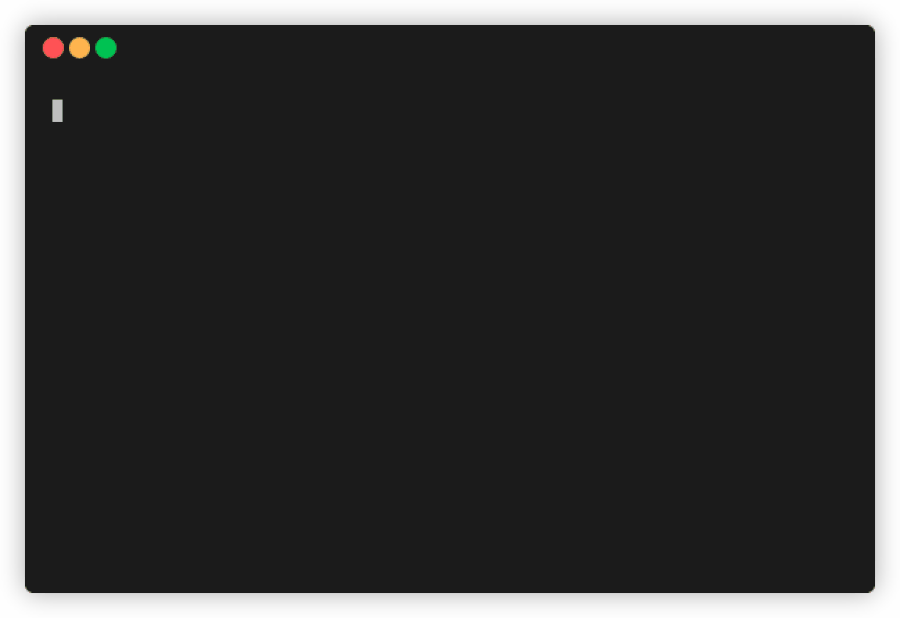

<div align="center">
    
</div>

<div align="center">
    <h1>Morax</h1>
</div>

[](https://forthebadge.com)
[](https://forthebadge.com)
[](https://forthebadge.com)
[](https://forthebadge.com)
[](https://forthebadge.com)
[](https://forthebadge.com)


Morax aims to provide monitoring of Coinbase assets on the command line. It capable of fetching the  wallet balance, wallet worth, wallet address and a graph of the crypto asset's price for the day.

<br/>

<p align = "center"></p>

## Installation

```shell
$ pip install morax
```

## Usage

⚠️   It is to be noted that this is a proof of concept and by using it, you hereby agree that I'm not responsible for any issues that may occur. Currently MacOS and Linux distributions are supported.

## Initialization

```
morax -l
```

## Authentication

This tool uses OAuth2.0 for authenication. Since OAuth2.0 requires a redirect URL, Refer to [repo](https://github.com/punidramesh/Morax-AuthServer) containing the source code used to setup a server to return the code parameter required to authenticate the user. Coinbase issues an access token for each wallet (BTC, ETH, LTC, etc), hence using this method of authentication, the user can only access the wallet they selected on the login page. To switch to other wallets, a 'switch' command is provided which will take the user back to Coinbase to authorize another wallet.

## Commands
* login
* wallet
* switch
* graph
* refresh

### Usage

```
morax <command>
```

## init

Used to initialize the tool, redirecting the user to the Coinbase authenication page for login.
If this command is run within 2 hours of login, the access token is renewed for another two hours. 

### Usage

```
morax -i
```

## wallet

Used to display wallet information including current spot price of crypto asset, balance amount in wallet, worth of balance amount in INR, and wallet address.

### Usage

```
morax -w
```

## graph

Used to visualize the price fluctuations of crypto asset as a graph.

### Usage

```
morax -g
```

## switch

Used to switch to another wallet. Redirects the user back to Coinbase OAuth page. The user is expected to select the desired wallet to switch to.

### Usage

```
morax -s
```

## refresh

Force refresh access token.

### Usage

```
morax -r
```

## How to contribute?

Please see [Contributing guidelines](https://github.com/punidramesh/morax/blob/main/CONTRIBUTING.md) for more information.

## Like it?

🌟 this repo to show support. Let me know you liked it on [Twitter](https://twitter.com/punidramesh).


## License
[MIT](https://github.com/manrajgrover/halo/blob/master/LICENSE) © Punid Ramesh
